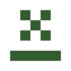

# soweli li sina

In this fun Toki Pona game, you solve various puzzles by changing the rules of the game itself! This fun, yet challenging, game inspired by *Baba is You* is sure to be a fun time!

musi toki pona musi ni la, sina pona e musi sona mute kepeken nasin ni: ante e lawa musi a! musi ni li musi, taso ike, li lon tan musi *Baba is You* li tenpo pona, ale la!

## Table of Contents *(kipisi lipu)*
* [Controls *(nasin pali)*](#controls-nasin-pali)
* [Misc. Instructions *(toki kute ante)*](#misc-instructions-toki-kute-ante)
* [Hints *(toki lili pi pana sona)*](#hints-toki-lili-pi-pana-sona)
* [Words *(nimi)*](#words-nimi)
* [Credits *(kulupu pali)*](#credits-kulupu-pali)
* [Similar Works *(pali sama)*](#similar-works-pali-sama)

## Controls *(nasin pali)*
| **Key *(ilo)*** | **Effect *(pali)*** |
| :---: | ---: |
| `w`, `↑` | Up *(sewi)* |
| `a`, `←` | Left *(soto)* |
| `s`, `↓` | Down *(anpa)* |
| `d`, `→` | Right *(teje)* |
| `Enter`, `Space` | Select *(lon)*, Pass *(lape)* |
| `Esc`, `Backspace` | Back *(weka)* |
| `r` | Reset *(open sin)* |

## Misc. Instructions *(toki kute ante)*
Run [`lib/main.py`](./lib/main.py) to play. Delete `save.csv` to start a new game; You do not need to do this the first time. If it starts to slow down, stop it and run it again.

sina wile musi la o open e lipu ni: [`lib/main.py`](./lib/main.py). sina wile open sin la o weka e lipu ni: `save.csv`; tenpo nanpa wan la sina o ni ala. tenpo pali li kama suli la, o pini o open e ona.

## Hints *(toki lili pi pana sona)*
Hover over the level number to see hint.

o tawa e misa lon nanpa tan toki lili pi pana sona.

| **English *(toki Inli)*** | **Toki Pona *(toki pona)*** |
| :---: | :---: |
| <a href="#" title="Move you onto win.">**00**</a> | <a href="#" title="o tawa e sina tawa pona.">**00**</a> |
| <a href="#" title="Go around.">**01**</a> | <a href="#" title="o tawa sike.">**01**</a> |
| <a href="#" title="Reread the rules.">**02**</a> | <a href="#" title="o lukin sin e lawa.">**02**</a> |
| <a href="#" title="Push past.">**03**</a> | <a href="#" title="o utala tan tawa.">**03**</a> |
| <a href="#" title="You are win.">**04**</a> | <a href="#" title="sina pona">**04**</a> |
| <a href="#" title="Don't negate it.">**05**</a> | <a href="#" title="o ala ala">**05**</a> |
| <a href="#" title="Fire is deadly.">**06**</a> | <a href="#" title="seli li ken moli.">**06**</a> |
| <a href="#" title="Fire is not deadly.">**07**</a> | <a href="#" title="seli li ken ala moli.">**07**</a> |
| <a href="#" title="Wall isn't anything.">**08**</a> | <a href="#" title="monsi li ala.">**08**</a> |
| <a href="#" title="Nothing is air.">**09**</a> | <a href="#" title="ala li kon.">**09**</a> |
| <a href="#" title="A whole new you!">**10**</a> | <a href="#" title="sina sin a!">**10**</a> |
| <a href="#" title="Use the keys sparingly.">**11**</a> | <a href="#" title="o kepeken lili e ilo.">**11**</a> |
| <a href="#" title="The flag is gullible.">**12**</a> | <a href="#" title="len li kute mute.">**12**</a> |
| <a href="#" title="Press space or enter to pass.">**13**</a> | <a href="#" title="o kepeken e ilo kon anu ilo lon tan tawa ala.">**13**</a> |
| <a href="#" title="You aren't stop.">**14**</a> | <a href="#" title="sina awen ala.">**14**</a> |
| <a href="#" title="Unsync the yous.">**15**</a> | <a href="#" title="o ante e sina tu.">**15**</a> |
| <a href="https://knowyourmeme.com/memes/loss" title="IS THAT LOSS!?">**16**</a> | <a href="https://knowyourmeme.com/memes/loss" title="ni li sitelen pi kama jo ala anu seme a!?">**16**</a> |
| <a href="#" title="Is door stop?">**17**</a> | <a href="#" title="lupa li awen ala awen?">**17**</a> |
| <a href="#" title="Wall isn't air, is it?">**18**</a> | <a href="#" title="sinpin li kon ala, anu seme?">**18**</a> |
| <a href="#" title="Air should be win.">**19**</a> | <a href="#" title="kon o pona.">**19**</a> |

## Words *(nimi)*
### Nouns *(nimi ijo)*
| **Sprite *(sitelen ijo)*** | **Glyph *(sitelen nimi)*** | **Word *(nimi)*** | **Translation *(toki ante)*** |
| :---: | :---: | :---: | :---: |
|    |  | soweli | animal |
|  |  | len | flag |
|  |  | sinpin | wall |
|  |  | seli | fire |
|  |  | pipi | bug |
|  |  | kiwen | rock |
| |  | kon | air |
|  |  | selo | outline |
|  |  | lupa | door |
|  |  | ilo | key |

### Adjectives *(nimi nasin)*
| **Glyph *(sitelen)*** | **Word *(nimi)*** | **Translation *(toki ante)*** | **Usage *(pali)*** |
| :---: | :---: | :---: | :--- |
|  | sina | you | Controllable object, wins level when on a `pona` object. |
|  | pini | shut | Destroys self and an `open` object when they share a space. |
|  | open | open | Destroys self and a `pini` object when they share a space. |
|  | awen | stop | Object cannot be moved. |
|  | tawa | push | Object is pushable. |
|  | pona | win | Wins level when on `sina` or `powe` object. |
|  | moli | kill | Destroys any `sina` object on it. |
|  | powe | proxy | Wins level when on a `pona` object. |

### Particles *(nimi lili)*
| **Glyph *(sitelen)*** | **Word *(nimi)*** | **Usage *(pali)*** |
| :---: | :---: | :--- |
|  | li | Used as `is`, `and` for predicates. |
|  | en | Used as `and` for subjects. |
|  | ala | Negator for subjects and/or predicates, used after word being negated. |

## Credits *(kulupu pali)*
* Code by Bach Davis *(toki sona tan jan Pa)*
* Levels by Nolan McCall *(kipisi tan jan Nolen)*
* Sitelen Leko Luka Font by Bach Davis *(sitelen leko luka tan jan Pa)*
* Sprites by Nolan McCall *(sitelen tan jan Nolen)*
* Design by Nolan McCall *(nasin lukin tan jan Nolen)*
* Logo by Bach Davis *(sitelen suli tan jan Pa)*
* README File by Bach Davis *(lipu* README *tan jan Pa)*
* Hints by Bach Davis *(toki lili pi pana sona tan jan Pa)*
* Inspired by [*Baba is You*](https://store.steampowered.com/app/736260/Baba_Is_You/) by Hempuli Oy *(sona mama tan* [*musi* Baba is You](https://store.steampowered.com/app/736260/Baba_Is_You/) *tan jan Empuli)*
* [Toki Pona](https://tokipona.org) by Sonja Lang *([toki pona](https://tokipona.org) tan jan Sonja)* 

## Similar Works *(pali sama)*
* [*Soweli li Mi*](https://formicant.github.io/soweli-li-mi/) by Formicant *(*[*musi* soweli li mi](https://formicant.github.io/soweli-li-mi/) *tan jan Pomikan)*
* [*Ale li Nimi*](https://editor.p5js.org/not-without-text/full/oE11X3Pnj) by Notwithouttext *(*[*musi* ale li nimi](https://editor.p5js.org/not-without-text/full/oE11X3Pnj) *tan jan Nowitateka)*